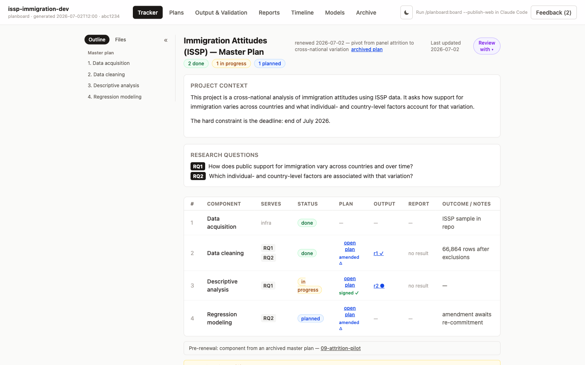
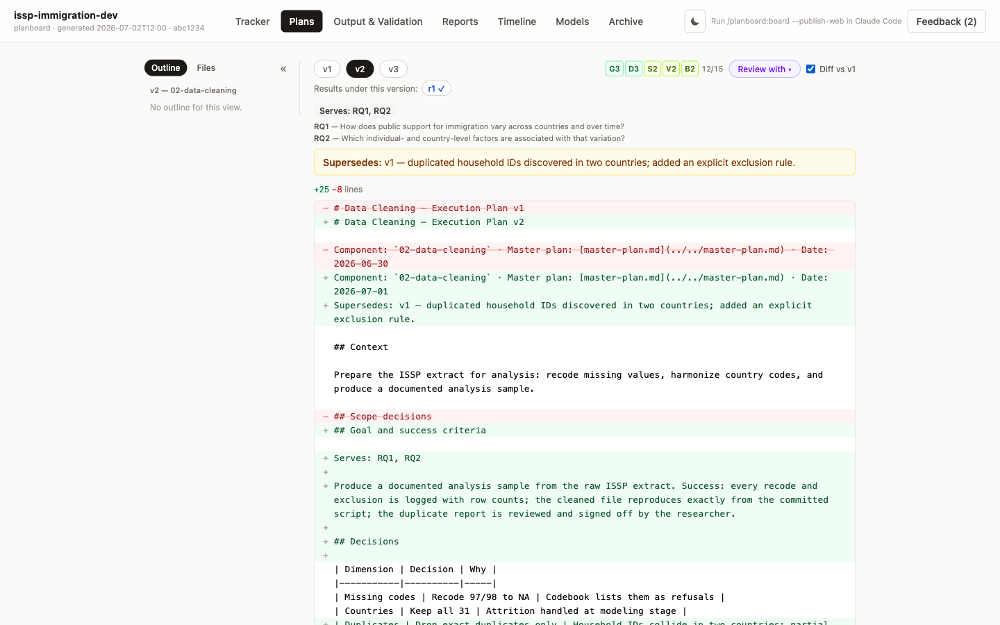
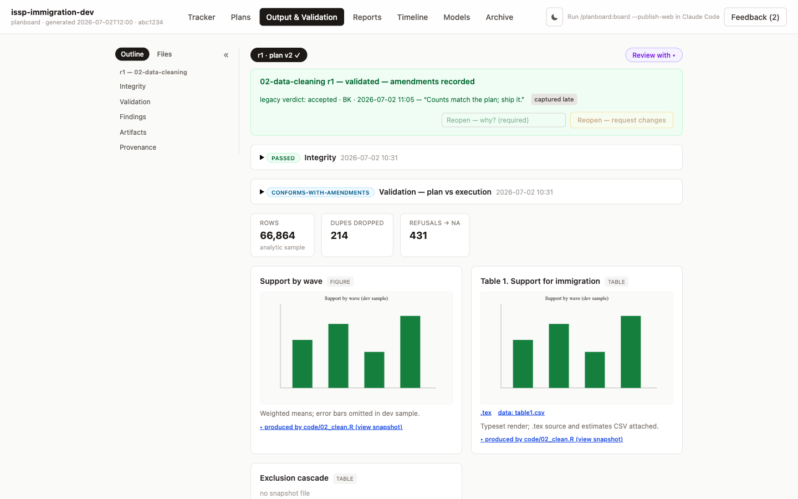
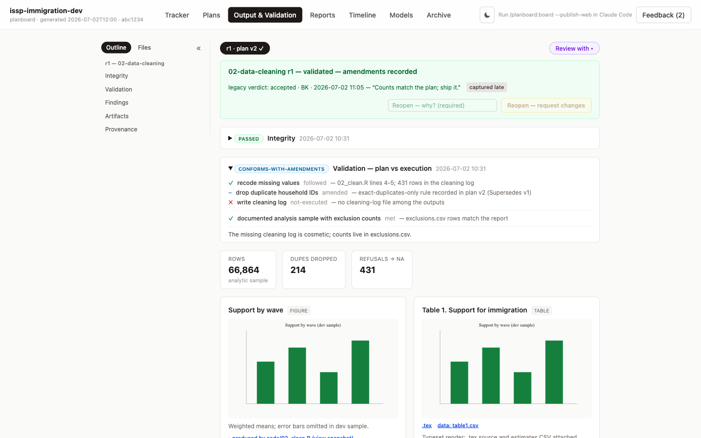

# planboard

> Stay the author of your research when a coding agent does the work.

Coding agents can produce plausible analyses faster than you can track why each one exists — five versions of a figure, three model specifications, and no record of which one made it into the draft, or why.

planboard keeps you in charge of that. It's a [Claude Code](https://claude.com/claude-code) plugin for social scientists: the agent works from a short plan you sign at the execution gate *before* it runs — what the work will do, why, and how you'll know it worked — then records every revision, decision, and result against that plan. You stay the author of the choices; the agent does the work and keeps the books.

It's the commit-before-you-look discipline you know from preregistration, made into a living plan rather than a frozen registry entry. It won't make an analysis correct — it makes the plan you approved, and every deviation from it, something you (and a coauthor, and a reviewer) can actually see.

If you already run Claude Code on real data work and have felt that record slip away from you, this is the fix. If you've held back from handing an agent your analysis because it felt ungovernable, this is what makes it governable.



<sub>The board over an example project. Each component shows its status, the plan you signed, whether its results are captured and verified, and — in the panel at the bottom — anything that has drifted out of sync.</sub>

## What you get

Five artifacts, each one an answer to *"what did the AI actually do, and can I stand behind it?"*

- **A plan you sign before the work.** For each piece of the project — a data-cleaning pass, one analysis, a simulation — you and the agent co-author a short execution plan: its goal, the scope decisions and why you made them, the steps, and how you'll judge success. The draft stays pending until `/execute` opens a slim sign session, or you run `/sign` sooner. Nothing is signed until you approve it, and signing is enforced, not suggested (see [the sign-off gate](docs/reference.md#the-sign-off-gate)).
- **A decision log written as decisions happen.** Every choice you and the agent make lands in an append-only, timestamped log — not reconstructed afterward from memory, when the reasons have already blurred.
- **Plan versions that are immutable.** When execution teaches you something and the plan changes, `/sync` records a new amendment version that says what changed and why. The old version is never edited. Re-execution signs a fresh commitment to that amendment. A recorded revision is legitimate; only a silent deviation is a breach.
- **Results you can verify.** Each analysis is captured as an immutable results bundle: the figures and tables (checksum-verified against the scripts that made them), the exact code, the key numbers, an automatic plan-vs-execution audit, and a mechanical score for how well the work held to its plan. Re-running an analysis can never quietly change what you already verified — a redo is the next bundle.
- **A board that shows all of it.** A browser dashboard renders the whole project — the tracker, every plan and its diffs, the results, the decisions, the reviews — so you, a coauthor, or a reviewer can actually read what happened. Nobody has to trust a chat log they'll never see.

## How it works in practice

The plugin adds a handful of commands to Claude Code. A normal project moves through a loop, and the agent carries the bookkeeping at every step.

**1. Opt a project in** — `/planboard:init`. A short interview seeds the master plan: the research questions, and the components (research activities) that serve them. Everything else is opt-in; the plugin does nothing in projects you haven't initialized.

**2. Scope a plan** — `/planboard:plan`. You and the agent scope the next component and prepare a scored draft. The board is available for reading, annotations, extra reviews, and a diff against the prior version. The draft stays pending, and the tracker marks the component `planned`.

**3. Sign and execute the loop** — `/planboard:execute`. A slim sign session shows the pending plan exactly as it will be committed. You approve it or request changes. Then one prompt asks whether to run now, which model to use, and whether to make a report. The agent commits the signed plan, executes it, captures and validates the bundle, reports when requested, updates the tracker and log, suggests one commit, opens the board, and proposes the next component. The plan is the spine it works against, not a cage; interpretive choices still come back to you before the agent acts. Run `/planboard:sign` when you want to sign pending plans without starting execution.

**4. Recover work outside the loop** — `/planboard:sync`. This manual checkpoint handles work done outside `/execute`, crashed sessions, hosted comments, and decisions that did not get logged. It updates the tracker and records an amendment automatically when confirmed execution deviated from the plan. The amendment says what changed and why; the old version is never edited. Re-execution must sign a new commitment first. Deviation is not failure; unrecorded deviation is.



<sub>A revision is a new version, not an edit. The banner records *why* v2 replaced v1 — here, validation found the decomposition wasn't reported the way the plan promised.</sub>

**5. Capture results manually when needed** — `/planboard:results`. The execution loop normally does this for you. The direct command seals a versioned, immutable bundle for out-of-loop work or a recapture: an agent-drafted report, snapshot copies of the figures and tables (checksum-verified against the scripts that made them), the code, the key numbers as tiles, and an automatic validation — an independent check comparing the governing signed plan or recorded amendment against what actually ran.



<sub>Every figure carries its numbers and a link straight to the script that produced it. Nothing on the board is a claim you can't trace back to code.</sub>

**6. Review, reopen, share** — `/planboard:board`. Open the dashboard. Read a plan and its revision history, annotate a draft, or review a results bundle: validation compares the governing plan with what executed, step by step, and defines the bundle's standing state. Reopen any finalized bundle with comments to drive a fix and a new capture. Share the whole thing with a collaborator who only has a browser. Plan approval stays in the slim sign session.



<sub>The validation checks the work against the plan you signed and flags where they diverge — advisory, never a gate. Reopen requests a fix without changing the immutable bundle.</sub>

The board runs on `python3` alone — nothing to install — as a small local server, or as a single self-contained HTML file you can email. It does not need Claude to open: every board open leaves a `./pb-board` script in the project, so a terminal command gets you the dashboard with no model in the loop, which matters on the day your session is rate-limited. Sharing to a private, password-protected link for browser-only collaborators is one more step (it uses Vercel and needs Node.js once, to set up). Full details are in the [reference](docs/reference.md#the-board).

## Who it's for

planboard is for a specific kind of work, not everyone who touches an AI.

It pays off when you are **already using a coding agent for real analysis** — data cleaning, modeling, simulation — and the project is one you'll have to **explain, revisit, or hand off**: a paper headed for review, a dissertation chapter, a collaboration, a grant deliverable, anything you'll still need to defend six months from now. The plan-and-sign step costs you something up front; its value grows with every revision, every session, and every person who later has to understand what the agent did. The longer the project, the more it earns its keep.

It is **not for one-off, throwaway exploration** — a quick plot to answer a question you'll forget by Friday doesn't need a durable record, and the workflow would just be friction. And a coauthor who only reads the board is a beneficiary, not a user: they never run a command.

If you're **curious about agents but wary** of turning one loose on your analysis, this is a way in. The point of the plan is that the agent's autonomy has a boundary you set and can see.

## Principles

- Plans are written before the work and govern it. A plan is a contract with a built-in amendment process, not a preregistration: a recorded revision is legitimate and expected; only a silent deviation is a breach.
- Plan versions are immutable. Revisions are new files that say what changed and why.
- The decision log is written as decisions happen, never backfilled.
- The researcher decides and signs. The AI asks, drafts, and keeps the books.

The workflow comes out of a methods paper on plan-based human–AI research partnerships (reference to follow). The quality rubric bundled with the plugin (`skills/managing-planboard/references/plan-rubric.md`) is a working draft.

## Install

In Claude Code:

```
/plugin marketplace add letitbk/planboard
/plugin install planboard@planboard
```

Then restart Claude Code, and run `/planboard:init` in a project to opt it in. See [QUICKSTART.md](QUICKSTART.md) for a walkthrough.

The core plan-review-execute-tail workflow needs only `python3` (no dependencies); `/sync` is the manual recovery checkpoint. The optional private web sharing additionally needs Node.js. Updating, pinning to a specific version, silencing update notices, and everything else is in the [reference](docs/reference.md).

## Reference

Everything technical lives in **[docs/reference.md](docs/reference.md)**: the full command table, the board in depth (live vs. snapshot, every view, sharing and private web publishing), results bundles, model profiles, the sign-off gate, what the plugin creates in your project, updating and version pinning, and how to develop the board itself.

**Works well with.** The workflow is self-contained, but pairs well with general process plugins — e.g. superpowers (TDD and worktree discipline for code-heavy components) or plannotator (in-browser plan annotation). Optional: nothing here depends on them, and plan documents always follow this plugin's own template and review flow.

## License

[PolyForm Noncommercial License 1.0.0](LICENSE). Free to use, modify, and share for any **noncommercial** purpose — academic research, teaching, personal, and non-profit use all qualify. Commercial use is not permitted without a separate license; contact the author.
